<div id="readme" class="Box-body readme blob js-code-block-container">
 <article class="markdown-body entry-content p-3 p-md-6" itemprop="This needs to locked down and 'never' changed"><p><a href="https://www.microchip.com" rel="nofollow"></a></p>

# AVR128DA48 ADC triggered via Event System - MCC Example

This repository provides a MPLAB X IDE project with a MCC (MPLAB Code Configurator) generated code example for ADC triggered via Event System. Using the event system, the on-board user button state change will trigger the ADC0 to start a conversion and read the analog signal from a 10kohm potentiometer on PD1.

With this setup, when the button oh the Curiosity Nano board is pressed, a single conversion of the ADC will be triggered on Analog Input 1 (PD1). An interrupt is set to be activated when the ADC conversion cycle is over. After this interrupt the result of the conversion is saved and sent via serial communication (USART1) and the on-board user LED is toggled to visualize the end of conversion.

## Related Documentation
More details and code examples on the AVR128DA48 can be found at the following links:
- [AVR128DA48 Product Page](https://www.microchip.com/wwwproducts/en/AVR128DA28)
- [AVR128DA48 Code Examples on GitHub](https://github.com/microchip-pic-avr-examples?q=avr128da48)
- [AVR128DA48 Project Examples in START](https://start.atmel.com/#examples/AVR128DA48CuriosityNano)

## Software Used
- MPLAB® X IDE 5.40 or newer [(microchip.com/mplab/mplab-x-ide)](http://www.microchip.com/mplab/mplab-x-ide)
- MPLAB® XC8 2.20 or newer [(microchip.com/mplab/compilers)](http://www.microchip.com/mplab/compilers)
- MPLAB® Code Configurator (MCC) 3.95.0 or newer [(microchip.com/mplab/mplab-code-configurator)](https://www.microchip.com/mplab/mplab-code-configurator)
- AVR-Dx_DFP 1.2.52 or newer Device Pack
- 8-bit AVR MCUs Lib version 2.3.0
- MPLAB Data Visualizer v2.20

## Hardware Used
- AVR128DA48 Curiosity Nano [(DM164151)](https://www.microchip.com/Developmenttools/ProductDetails/DM164151)
- Potentiometer: 10kohm

## Setup
The AVR128DA48 Curiosity Nano Development Board is used as test platform.
<br>

The wiring diagram is presented in the figure below:
<br>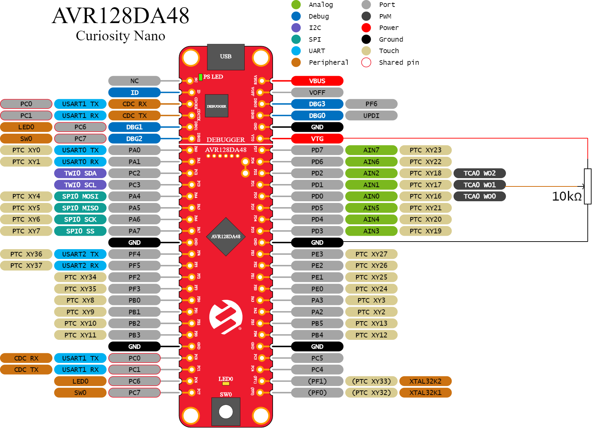

The following MCC configurations must be made for this project:

 - System Module
    1. Internal Oscillator (24 MHz)
    2. Prescaler enabled (6x)
    3. WDT disabled

<br>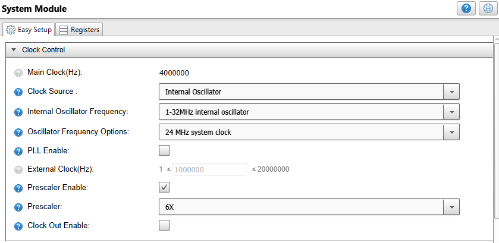

 - ADC0
    1. Input clock is the default 4MHz system clock divided by 2
    2. AIN/1 (PD1) is the input of the ADC
    3. 12-bit Resolution mode
    4. Single Ended Mode Conversion
    5. Result Ready Interrupt is enabled
    6. Event System is enabled

<br>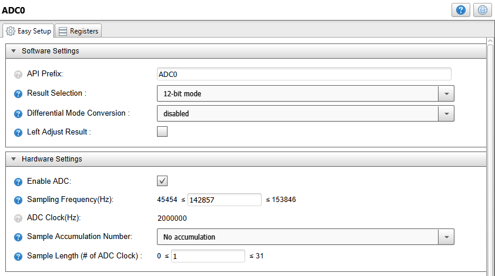
<br>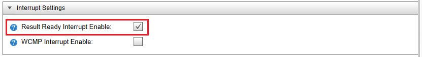
<br>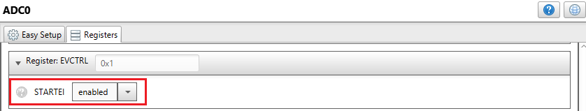
<br>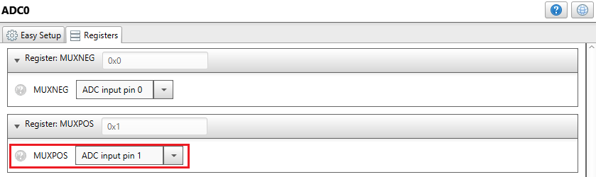

- VREF
    1. VDD reference is selected for ADC0
    2. Enable reference always ON for ADC0

<br>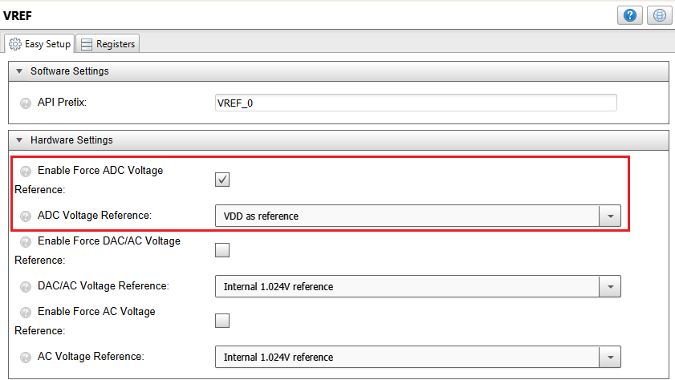

- EVSYS
    1. Event Channel 3 Generator is Port C - Pin 7
    2. Connect user ADC0 to event channel 3

<br>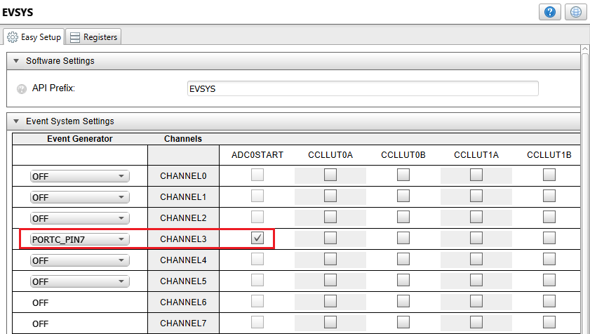

- USART1
    1. Printf support 
    2. Async mode
    3. Baud Rate: 9600
    4. Enable USART Transmitter
    5. No Parity, 1 stop bit, 8-bit character size

<br>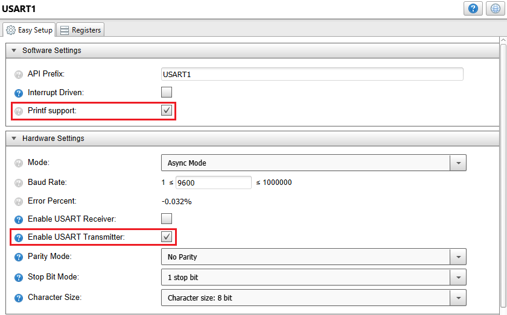

- Interrupt Manager
    1. Global Interrupts Enabled

<br>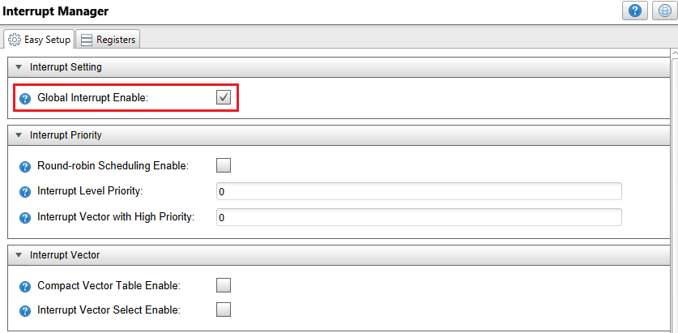

- Pin Manager
    1. PC0 set as Digital output (USART1 - TX)
    2. PC1 set as Digital input (USART1 - RX)
    3. PC7 set as Digital input with the internal pull-up enabled (button)
    4. PC6 set as Digital output (LED for visualization)
    5. PD1 set as Analog input (ADC input)

<br>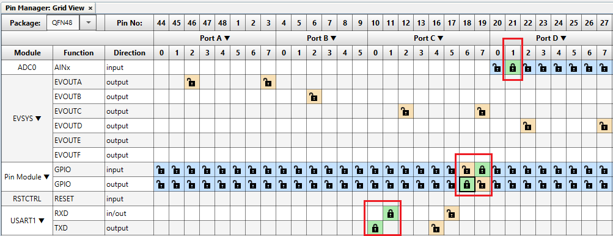
<br>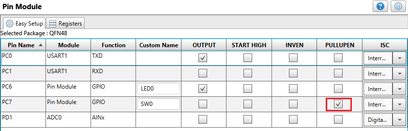


## Demo Code 

The source code for this project can be downloaded from the current page by clicking the "Download" button, or if you want to make your own project, please pay attention to the following steps:
 - After making the MCC settings, press the "Generate" button, and this will generate the required .c and .h files.
 - Then edit the resulting code by adding the following code snippets.
    
    1. In the "adc0.c" file, at the beginning, after the include section:
        ```
        #include <stdbool.h>   
 	
        extern volatile bool sharedAdcFlag;
        extern volatile uint16_t sharedAdcValue;
        ```
    2. In the "adc0.c" file, in the ADC0 Result Ready Interrupt:
        ```
        /* This flag marks the end of an ADC conversion cycle */
        sharedAdcFlag = true;
        /* Reading the conversion result */
    	sharedAdcValue = ADC0_GetConversionResult();
        ```
    3. In the "main.c" file, at the beginning, after the include section:
        ```
        #include <stdbool.h>

        volatile bool sharedAdcFlag = false;
        volatile uint16_t sharedAdcValue = 0;
        uint16_t adcValue = 0;

        /* macro defined to toggle the on-board LED */
        #define LED_Toggle() PORTC.OUTTGL = PIN6_bm 
        ```
    4. Also in the "main.c" file, add the following code snippet inside the while(1) loop.
        ```
       /* if an ADC conversion has ended and the flag was set */
	   if(sharedAdcFlag == 1)
        {
            /* atomic read of the ADC conversion result */
            DISABLE_INTERRUPTS();
            adcValue = sharedAdcValue;
            ENABLE_INTERRUPTS();

            /* the LED on PC6 is toggled to visualize the end of the conversion cycle */
            LED_Toggle();

            /* printing both the raw and computed results */
            printf("ADC Conversion Raw Result = %d\r\n", adcValue);
            printf("ADC Conversion Result [V] = %.2fV\r\n", adcValue / 4096.0 * 3.3);

            /* clearing the flag */
            sharedAdcFlag = false;
        }
        ```

The ADC Conversion Result is determined based on the raw value the ADC outputed following the equation below:

<br>

The flow diagram is presented in the picture below:

<br>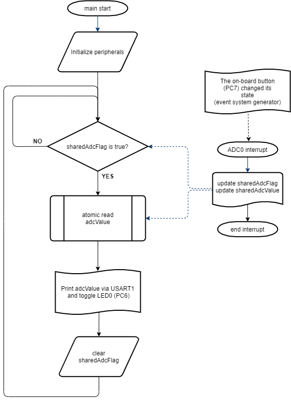

The Software and Hardware is mapped toghether in the Block Diagram below:

<br>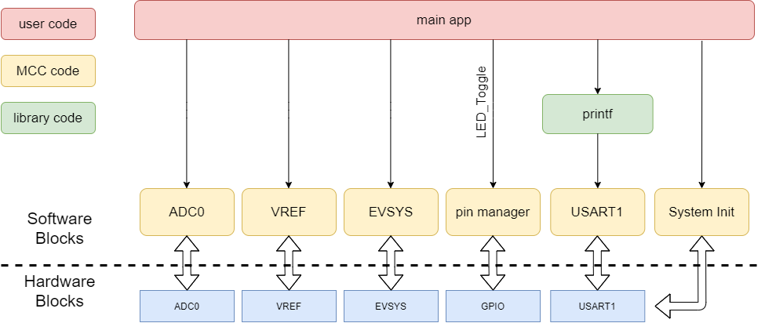

## Operation

1. After making the connections according to the wiring diagram, connect the AVR128DA48 Curiosity Nano Development Board to PC using the USB cable.
2. Build the firmware and load the generated hex file into MCU.


## Demo:

After making the setup according to the wiring diagram presented in the Hardware section and uploading the firmware, the user-button (PC7) from the AVR128DA48 Curiosity Nano Board will trigger via Event System an ADC conversion. The end of this conversion will be marked by the toggle of the on-board LED (PC6) and the conversion result will be printed via serial communication both in the raw and computed format.

In the figure below are presented results obtained using the MPLAB Data Visualizer tool.

<br>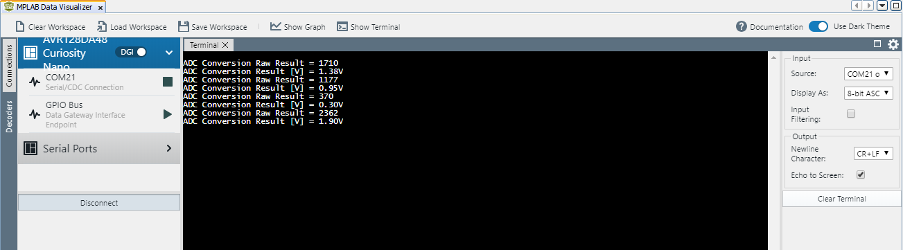

Note: If you want to install MPLAB Data Visualizer, within MPLAB X IDE, go to Tools -> Plugins -> Available Plugins.

## Summary
This example represents a basic implementation of using ADC via Event System. Using the event system, the button state change triggers the ADC configured in single conversion mode. Connected to the Analog Input 1 (PD1) is a 10kohm potentiometer which generates the analog signal. An interrupt is set to be activated when the ADC conversion cycle is over. The result is printed via serial communication and the on-board LED is toggle for visualization purposes.
